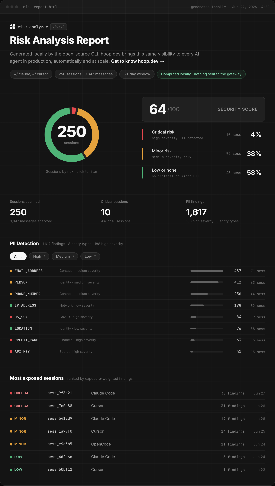

<div align="center">

# 🔍 hooprs

### What did your AI coding agent see?

`hooprs` scans your local AI coding sessions — Claude Code, Cursor, OpenCode —
for PII and secrets, **entirely on your machine**, and shows you exactly
which sessions leaked what.

[](https://github.com/hoophq/rs/actions/workflows/test.yml)
&nbsp;·&nbsp; No gateway &nbsp;·&nbsp; No network &nbsp;·&nbsp; No API calls



</div>

```bash
brew install hoophq/tap/hooprs && hooprs
```

One command. It discovers every session on disk, runs detection in-process,
prints a risk summary to the terminal, and opens a self-contained HTML report
ranking your most exposed sessions.

---

## Why hooprs

Every prompt you type and every file your agent reads becomes session history
on your disk — and some of it is credentials, customer data, national IDs.
You have no idea how much until you look. hooprs looks:

- 🔒 **Local only.** Detection runs in-process on your machine. No DLP
  service, no API calls, nothing leaves your disk — for a scanner that reads
  your secrets, this is the whole point.
- ✅ **Verified, not just shape-matched.** Credit cards are Luhn-checked,
  IBANs mod-97-checked, SSNs range-validated. A 16-digit number that fails
  the checksum never reaches your report.
- 🎯 **Ranked, not dumped.** Sessions are tiered `critical` / `minor` / `low`
  and ranked by exposure, so you triage the ten sessions that matter instead
  of scrolling ten thousand findings.
- 🤫 **Value-free reports.** The HTML and JSON reports carry entity types,
  counts, and severities — never the matched values. Sharing the report never
  re-leaks the leak.
- 🚦 **Direction-aware.** Findings split into input (what you typed) and
  output (what the agent pulled into its context) — leaks the agent *read*
  weigh heavier than ones you pasted.

> The command is `hooprs` rather than `rs` because macOS and the BSDs ship a
> stock `rs(1)` utility (reshape a data array) that would otherwise be
> shadowed.

---

## Install

```bash
# Homebrew — macOS & Linux
brew install hoophq/tap/hooprs

# Shell script — macOS & Linux
curl -fsSL https://raw.githubusercontent.com/hoophq/rs/main/install.sh | sh

# npm — also covers Windows (x64)
npx @hoophq/rs
```

All three install a prebuilt binary — no compile step. The shell script
verifies the checksum and installs to `/usr/local/bin` (or `~/.local/bin` when
that's not writable); pin a version with `HOOPRS_VERSION=v0.2.0` or change the
destination with `HOOPRS_INSTALL_DIR=~/bin`. The Homebrew formula lives in
[hoophq/homebrew-tap](https://github.com/hoophq/homebrew-tap); npm pulls the
binary through optional dependencies (`@hoophq/rs-<os>-<arch>`).

Building from source needs Go 1.24+ and has a single pure-Go dependency (the
[alcatraz](https://github.com/hoophq/alcatraz) detection library):

```bash
go build -o hooprs ./cmd/hooprs
```

## Quickstart

Scan everything, print the summary, write and open `risk-report.html`:

```bash
hooprs
```

Narrow it down:

```bash
# only the last 30 days, plus a machine-readable JSON report
hooprs -days 30 -json risk-report.json

# only Cursor sessions whose project matches a pattern
hooprs -tools cursor -project 'my-app'

# raise the confidence bar (default 0.4)
hooprs -min-score 0.6

# show the actual leaked values in the terminal (never in the reports)
hooprs -show-values
```

<details>
<summary><b>All flags</b></summary>

<br>

| Flag | Default | Description |
|------|---------|-------------|
| `-out` | `risk-report.html` | Path for the self-contained HTML report |
| `-json` | _(off)_ | Also write the machine-readable risk report here |
| `-tools` | `claude,cursor,opencode` | Sources to scan |
| `-project` | _(all)_ | Regexp filter on session project |
| `-session` | _(all)_ | Regexp filter on session id |
| `-days` | `0` (all time) | Only sessions started within the last N days |
| `-home` | `$HOME` | Home directory to discover sessions under |
| `-rules` | _(none)_ | Guardrails rules JSON file |
| `-min-score` | `0.4` | Minimum detection confidence (0 to 1) to count |
| `-critical-weight` | `60` | Security-score penalty weight (0 to 100) for the critical-session share |
| `-engine` | `alcatraz` | Detection engine: `alcatraz` (full PII set) or `stub` (zero-dependency fallback) |
| `-incremental` | `false` | Only scan content appended since the last run |
| `-state` | `~/.risk-analyzer/state.json` | Incremental scan state file |
| `-quiet` | `false` | Suppress the terminal summary |
| `-show-values` | `false` | Print the matched high-severity values for the top 10 critical sessions in the terminal summary (never written to the HTML/JSON reports) |
| `-open` | `true` | Open the HTML report in the default browser when done |
| `-version` | `false` | Print the hooprs version and exit |

By default every run is a full snapshot of all your sessions. `-incremental`
persists per-file byte offsets so subsequent runs read only the content
appended since the last run (useful for "what changed since last time").

</details>

---

## What it detects

Structured PII (via the [alcatraz](https://github.com/hoophq/alcatraz) engine)
plus the secret types common in coding sessions (via hooprs's own secrets
pack):

| Family | What's in it |
|--------|--------------|
| **Secrets** | API keys (GitHub, OpenAI, Google, Slack, Stripe, JWT, and a generic high-entropy `key = value` heuristic), AWS access keys, private keys, passwords |
| **Financial** | Credit cards (Luhn-checked), IBAN (mod-97-checked), crypto addresses, ABA routing numbers |
| **Government / national IDs** | US SSN, ITIN, passport, driver license; UK NINO; plus national identifiers for AU, IN, IT, ES, SG, PL, KR, FI and TH |
| **Health** | Medical license; UK NHS and AU Medicare numbers |
| **Contact / network** | Email, phone, IP address, URL |

Detection pairs regex **patterns** with checksum and format **validators**
(Luhn, IBAN mod-97, SSN/national-ID range rules), and matches below the
`-min-score` threshold are dropped. Pass `-engine stub` for a zero-dependency
regex fallback.

> **Note on NER:** `PERSON`/`LOCATION`-style entities that need an NLP model
> stay out of this version. The analyzer sits behind a small
> `analyze.Analyzer` interface, so a future NLP-backed engine drops in without
> touching the pipeline.

---

## How it works

```
sources  →  analyze  →  risk  →  report
claude/      regex +     tiers ·    terminal +
cursor/      validators  score ·    html + json
opencode     (local)     exposure
```

**Sources** discover and parse each tool's on-disk session format into one
normalized model; **analyze** runs the detection engine over every message;
**risk** turns raw findings into tiers, exposure ranking, and a score;
**report** renders the terminal summary and the self-contained HTML.

The risk model:

- **Tier** per session: `critical` (any high-severity entity), `minor`
  (medium-severity only), or `low`.
- **Exposure** ranks sessions by a severity-weighted finding count that favors
  output (data pulled into the agent context) over input.
- **Security Score** = `clamp(0, 100, round(100 − W·critical/total − 20·minor/total))`,
  where `W` is the critical penalty weight (`-critical-weight`, default 60).

Severity and data-family per entity type live in
[`risk/entities.go`](risk/entities.go).

---

## Make it yours

Layer your own detection rules with `-rules <file>` — direction-aware
(`input` = what you typed, `output` = assistant/tool output). See
[`examples/guardrails.json`](examples/guardrails.json):

```json
{
  "rules": [
    { "name": "internal-hostnames", "type": "regex", "direction": "both",
      "pattern": "\\b[a-z0-9-]+\\.internal\\.example\\.com\\b" },
    { "name": "private-key-material", "type": "deny_words", "direction": "output",
      "words": ["BEGIN RSA PRIVATE KEY"] }
  ]
}
```

Violations get their own section in the summary and the report, counted per
rule.

---

## Privacy

Everything runs on your machine. The HTML/JSON reports contain **only** entity
types, counts, severities, and session identifiers — never the matched values.
Nothing leaves your machine.

`-show-values` is the one deliberate exception: it prints the matched
high-severity values for the top 10 critical sessions **to the terminal only**,
so you can locate the actual leaks. The HTML and JSON reports stay value-free
even with the flag on — and there's a test pinning that guarantee.

---

## Layout

```
cmd/hooprs/    CLI: flags → discover → analyze → risk → render
sources/       discover & parse claude/cursor/opencode sessions
state/         incremental scan offsets
types/         normalized Session/Message model
analyze/       Analyzer interface + alcatraz engine, shared secrets pack, Stub fallback
guardrails/    local rules loader + direction-aware matcher
risk/          severity catalog + risk model (tiers, exposure, score)
report/        terminal + self-contained HTML renderer (embedded CSS/JS)
```

---

Built by the team behind [hoop.dev](https://hoop.dev).
